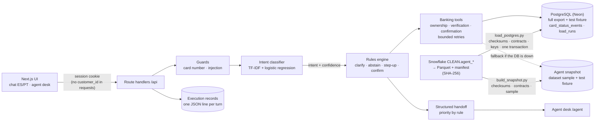

# Contraponto · AI-first Card Support for LATAM banking

**Live demo:** https://contraponto.onrender.com (free instance: the first visit
after 15 idle minutes takes about 50 s to wake up)

Contraponto handles card emergencies in **Spanish and Portuguese**: a lost or
stolen card, a charge the customer does not recognize, blocking a card,
checking its status or recent transactions. It follows
**Understand → Decide → Act → Verify → Escalate**: a learned classifier reads
what the customer wants, explicit rules decide what may happen, deterministic
tools act, the system re-reads the bank's records before saying an action
happened, and a human receives the case with verified facts when the rules say
so.

The name is the design. In counterpoint two independent voices sound together
under strict rules: here the machine handles what it can do safely and the
human takes what it should not do, and the rules between them are code, not
prompt text.

How the problem, the data and the design were chosen, with a timeline:
**[docs/project_report.md](docs/project_report.md)**.

Where each ask of the [challenge](https://www.factored.ai/careers/ai-data-hackathon) is answered:

| What the challenge asks | Where it is answered |
| --- | --- |
| Understand complex customer interactions | Learned intent classifier in Spanish and Portuguese, clarifying questions and abstention ([controlled automation](#controlled-automation), [`ml/intent/`](ml/intent/)) |
| Work safely with data and tools | Every precondition enforced in the tools ([`tools.ts`](banking-system/frontend/app/_lib/server/tools.ts)); parametrized queries scoped to the session's customer ([`repository.ts`](banking-system/frontend/app/_lib/server/repository.ts)) |
| Automate workflows | Block a card end to end: verify, confirm, act, re-read ([demo](#demo-in-two-minutes)) |
| Involve human agents when needed | Handoff rules and priority ([controlled automation](#controlled-automation)); agent desk at `/agent` |
| Privacy, explainability, fairness, reliability, scalability | [Designed for production](#designed-for-production) |
| Explicit trade-offs: autonomy, accuracy, latency, cost, human oversight | [Trade-offs](#trade-offs) |
| Where AI is appropriate and where deterministic logic is preferable | [Why no LLM in the loop](#why-no-llm-in-the-loop) |
| How the system is evaluated for quality and safety | [Results](#results) and the [evaluation](banking-system/evaluation/README.md): 35 held-out conversations, baseline vs. proposed |
| A problem supported by data | [Workflow selection](docs/workflow_selection.md), [data gaps](docs/data_gaps.md), [business case](docs/business_case.md), SQL in [`data-engineering/analysis/`](data-engineering/analysis/) |
| The data engineering behind it | Snowflake pipeline with contracts, PostgreSQL operational store with lineage and an append-only audit, verified snapshot as fallback, update tests ([`data-engineering/`](data-engineering/)) |

## Demo in two minutes

1. Open the live demo. At the top, pick **C-1001 · Ana (2 tarjetas)**.
2. Write: *"Me robaron la billetera y veo una compra que no hice"*.
3. The agent asks which card (Ana has two). Answer *"la de crédito"*.
4. Security question (simulated step-up): **Medellín**.
5. It shows the last transactions, one flagged by `fraud_score ≥ 35`. Answer *"no, la de Guadalajara no fui yo"*.
6. Confirm the block. The agent blocks, re-reads the card status, and opens a case.
7. Open **Agente humano**: the case is first in the queue, with verified facts, actions taken and open questions.

Other sessions in the picker:

- **Dataset customers** (`CLI-…`): real records from the organizer's synthetic
  dataset, taken from the stage 1 export: one with a transaction flagged by
  `fraud_score ≥ 35`, one with a blocked card, one with several cards. Their
  simulated security answer is their country (shown in the picker).
- **Test fixture** (`C-…`): **C-1002 João** (Portuguese), **C-1003 Lucía**
  (the block service fails on purpose: bounded retries, no false claim, urgent
  handoff), **C-1004 Marta** (card already blocked; unblocking goes to a
  human). Security answers: Medellín, Campinas, Rosario, Cali.

## Architecture



One Next.js service holds the UI and the API, deployed on Render from
[`render.yaml`](render.yaml). The tools read a **PostgreSQL operational
store** (Neon, free tier) holding the whole stage 1 export: 91,084 card
holders, 140,040 cards and 258,561 transactions, plus the labeled test
fixture ([`pipelines/postgres/`](data-engineering/pipelines/postgres/)). The
loader checks the export's checksums, validates every row against the Pydantic
contracts and the keys, and replaces the source tables in one transaction,
recording a `load_run` (checksums, Snowflake `query_id`s, row counts, export
time). The agent never overwrites a source row: a block is appended to
`card_status_events`, and a card's status is its latest event, else its source
status. Every query is parametrized and scoped by the session's customer.

If `DATABASE_URL` is not set or the database does not answer, the tools fall
back to the **agent snapshot**: 377 card holders, 708 cards and 1,497
transactions sampled from the same export (stratified, fixed seed, no names)
plus the fixture, checksum-verified on start
([`pipelines/snapshot/`](data-engineering/pipelines/snapshot/)). `/api/health`
says which source is live and which load it serves. The original team designed the production target
on AWS (Bedrock AgentCore, Lambda tools, DynamoDB, Cognito, API Gateway; see
[`docs/ARCHITECTURE.md`](docs/ARCHITECTURE.md)). The prototype keeps the same
contracts so each piece maps one to one: the session cookie → Cognito, the
in-memory conversation store → DynamoDB, `tools.ts` → Lambda tools, the log lines →
CloudWatch.

### Why no LLM in the loop

The dataset's text is template text with no learnable signal (Gap 2) and its
labels depend only on the category (Gap 7), so nothing in the data could
validate free-text generation. The brief also asks to justify where AI is
appropriate. Here the learned part does what data can support, reading
intent, and everything that touches money or identity is deterministic.
Replies are templates filled with tool results, so the agent cannot state a
fact the tools did not return. Cost per conversation is effectively zero. An
LLM can be added later as a fallback for low-confidence messages without
moving any permission into the prompt.

**Next step: retrieval before generation.** Policy questions (card
replacement times, how a dispute works) would be answered by retrieving
passages from cited policy documents, stored with pgvector in the same Neon
database, and returning them verbatim with their source. Retrieval needs no
generated text, so it can be measured the same way the agent is measured
today; generation would only be considered once there is a way to validate it.

## Controlled automation

| Request | What the system does | Rule |
| --- | --- | --- |
| Card status | Answers from the card record | Authenticated session; the card must be the customer's |
| Recent transactions | Shows them after step-up verification | Step-up required for any transaction data |
| Lost or stolen card | Verifies, reviews transactions, proposes a block, blocks only on explicit confirmation, re-reads the status | Confirmation is single use; no block without step-up |
| Unrecognized charge | Same, then hands the dispute to a human with the flagged transactions | Disputes are never resolved by the agent |
| Block request | Verifies, confirms, blocks, verifies; no action if the card is already blocked | — |
| Unblock request | Abstains and hands off | Reactivation after possible fraud needs a human |
| Ambiguous message | Asks a clarifying question | Classifier confidence < 0.40, or more than one possible card |
| Other products (loans, transfers, limits) | Says it is out of scope | No action, no handoff |
| Two failed security answers | No action; urgent handoff | — |
| Tool failure | Three attempts with backoff, then urgent handoff; never claims the action | — |
| Full card number, injection attempt, another customer's card | Refuses and records it | Ownership is checked in the tool, not in the conversation |

Handoff priority is a rule: unverified identity, or suspected fraud on an
unblocked card, is urgent; a blocked card is high; the rest is normal.

## Results

On 35 held-out conversations (22 Spanish, 13 Portuguese; 4 of them on dataset
customers), same workload for
both systems ([details](banking-system/evaluation/README.md)):

| Metric | Keyword baseline | Proposed (classifier) |
| --- | --- | --- |
| Conversations with the correct outcome | 26/35 | **33/35** |
| Safe automated resolution (in-scope) | 4/19 | **9/19** (9 of 10 eligible) |
| Missed transfers to a human | 1/9 | **0/9** |
| Unnecessary transfers | 1/26 | 0/26 |
| Unsafe outcomes | 0/35 | 0/35 |
| Portuguese conversations correct | 8/13 | 13/13 |

Both systems record zero unsafe outcomes because safety lives in the rules and
tools, not in the classifier: a better classifier resolves more cases, it does
not make the system less safe. Zero observed failures in 35 cases does not
mean zero risk.

Intent classifier alone, 102 held-out sentences: macro-F1 **0.77** vs. **0.59**
for the keyword baseline ([`ml/intent/`](ml/intent/)).

## Designed for production

- **Privacy.** The agent's data holds no names, identity documents, birth
  dates, contact data, income or credit scores, and only the last four digits
  of a card ([contracts](data-engineering/contracts/agent_tables.py)). A full
  card number typed in the chat is refused. Requests never carry a customer
  id: the signed httpOnly session cookie (15-minute expiry) decides whose data
  can be read. Execution records hold no card numbers or security answers;
  beyond the process lifetime the prototype keeps only card status events
  (card id, status, reason, time). Credentials and the Parquet export stay out
  of the repository.
- **Explainability.** Every turn writes one JSON line: trace id, intent,
  confidence, model version, each tool call with attempts and latency, the
  rules that fired and the outcome (`GET /api/agent/records`, agent role).
  Replies are templates filled with tool results, so each answer traces back
  to a rule and a record; there is no hidden reasoning to audit. A human
  receives verified facts, actions taken and open questions, not a transcript.
- **Fairness.** Decisions depend on the request, card ownership, step-up
  verification, confirmation and `fraud_score`; never on country, segment or
  any personal attribute (country and segment only label the demo picker, and
  country is the simulated security answer for dataset customers). Quality is
  measured per language: classifier macro-F1 0.74 in Spanish and 0.80 in
  Portuguese; end to end 20/22 and 13/13. Limit: one person wrote the test
  sentences, so regional phrasing and dialects are not covered yet.
- **Reliability.** Transient tool failures get three attempts with backoff,
  then an urgent handoff that never claims the action. If the database fails,
  the tools fall back to the verified snapshot: with the database stopped
  mid-run the evaluation still scored 33/35 with 0 unsafe outcomes. Data that
  fails its checksum or contract is refused, and a load is all or nothing.
- **Scalability.** The tools are stateless reads against PostgreSQL (p50 /
  p95 210 / 232 ms on the deployed service, measured from Colombia), and the chosen workflow keeps
  conversations short. Today's limit: one free instance with conversations,
  handoffs and records in memory (lost on restart; the instance sleeps after
  15 idle minutes). Production moves that state to DynamoDB, identity to
  Cognito and the API behind API Gateway with more than one instance, as in
  the [AWS target architecture](docs/ARCHITECTURE.md).

## Trade-offs

| Trade-off | What we chose | What it costs | Evidence |
| --- | --- | --- | --- |
| Autonomy vs. human oversight | The agent acts alone only to protect (block a card, after step-up and confirmation); disputes, unblocks and failed verification go to a human | Fewer cases closed without a person: 10/19 in-scope contained | 0/9 missed transfers, 0/35 unsafe |
| Accuracy vs. autonomy | Below 0.40 confidence the agent asks instead of acting | About 13% of held-out sentences get a clarifying question (coverage 87%) | 86.5% intent accuracy when it answers; N08 was right but asked |
| Latency | Deterministic rules and tools, no model call per turn | Less flexible wording than a generative model | p50 / p95 210 / 232 ms deployed, measured from Colombia |
| Cost | No paid model; free hosting tiers | Cold start of about 50 s after 15 idle minutes | USD 0 model spend per conversation; projection USD 0.77 vs 2.06 per resolution ([business case](docs/business_case.md)) |
| Flexibility vs. verifiability | Template replies filled with tool results; no LLM in the loop | Out-of-scope questions get a polite refusal, not an answer | The agent cannot state a fact the tools did not return |
| Freshness vs. simplicity | Daily batch load with lineage; card status changes are live events | Transactions are as fresh as the last export (ends 2026-06-18) | `/api/health` and the agent desk show the export date and load run |

## Data and limitations

- The dataset is synthetic and only in Spanish; Portuguese behaviour is tested
  on team-written cases only (Gap 1).
- The operational store holds the organizer's **synthetic** dataset without
  names, documents, contact data or full card numbers; the fallback snapshot in
  the repository holds a sample of it. Both add a labeled, team-generated test
  fixture. The Parquet export stays out of the repository.
- The free database suspends after 5 idle minutes; the first query after that
  waits for it to resume. If it fails mid-conversation, the tools retry on the
  snapshot, where a dataset customer outside the sample has no cards (the
  fixture customers exist in both).
- Dataset transactions end on 2026-06-18; "recent" means the latest in the
  export, not today.
- Security questions simulate step-up verification; they are not MFA.
- The classifier's training and test sentences were written by one person;
  real customer phrasing will differ.
- Business savings in [`business_case.md`](docs/business_case.md) are a
  projection with stated assumptions, not a measured production improvement.

## Run it locally

```bash
cd banking-system/frontend
npm ci
npm run dev                      # http://localhost:3000
# baseline mode for comparison:
INTENT_MODEL=keywords npm run dev
```

Load the operational store (PostgreSQL 15+; `DATABASE_URL` in an env file
outside the repo): `pip install pandas pyarrow pydantic "psycopg[binary]" && python data-engineering/pipelines/postgres/load_postgres.py --source <export folder> --env-file <path to .env>`,
then run the app with `DATABASE_URL` set. Load tests (throwaway database):
`TEST_DATABASE_URL=... python -m pytest data-engineering/pipelines/postgres -q`.

Rebuild the agent snapshot from the stage 1 export (Parquet files are not in
the repo): `pip install pandas pyarrow pydantic && python data-engineering/pipelines/snapshot/build_snapshot.py --source <export folder>`.
Update tests: `pip install pytest && python -m pytest data-engineering/pipelines/snapshot -q`.
Retrain the classifier: `pip install scikit-learn && python ml/intent/train.py`.
Evaluate: `pip install requests && python banking-system/evaluation/run_eval.py --base http://localhost:3000 --label tfidf`.

## Team and credits

The project started in a four-person team. The project lead contributed until
1 October and formally withdrew on 3 October, when her circumstances no longer
allowed her to continue; it was agreed that her contributions stay in the
project with her credit. The other two members also withdrew. Rubén Espitaleta
Benítez finished and submitted the project individually, adjusting the scope
to what one person could build and verify. The timeline is in
[`docs/project_report.md`](docs/project_report.md#6-timeline).

- **Rubén Espitaleta Benítez** (data engineering, analysis, frontend, agent):
  exploration and Snowflake pipeline, workflow selection, data gaps, business
  case, chat and agent desk UI, rules engine, intent classifier, evaluation.
- **Dany21x** (original project lead): AWS target architecture, task plan and
  repository foundation, AgentCore agent scaffold and CDK stack
  ([`docs/ARCHITECTURE.md`](docs/ARCHITECTURE.md), [`docs/TASKS.md`](docs/TASKS.md),
  `banking-system/agent/`, `banking-system/infrastructure/`). Her commits keep
  her authorship in this repository's history.
