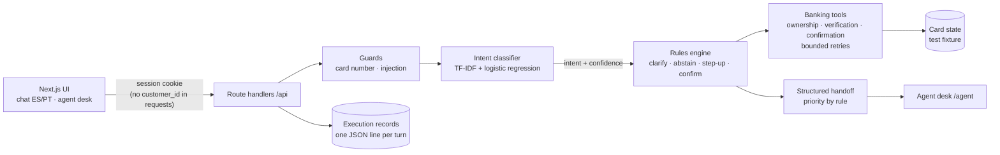

# Contraponto · AI-first Card Support for LATAM banking

**Live demo:** https://contraponto.onrender.com (free instance: the first visit
after 15 idle minutes takes about 50 s to wake up)

Contraponto handles card emergencies in **Spanish and Portuguese**: a lost or
stolen card, a charge the customer does not recognize, blocking a card,
checking its status or recent transactions. It follows
**Understand → Decide → Act → Verify → Escalate**: a learned classifier reads
what the customer wants, explicit rules decide what may happen, deterministic
tools act, the system re-reads the bank's records before saying an action
happened, and a human receives the case with verified facts when the rules say
so.

The name is the design. In counterpoint two independent voices sound together
under strict rules: here the machine handles what it can do safely and the
human takes what it should not do, and the rules between them are code, not
prompt text.

| Ask from the brief | Where it is |
| --- | --- |
| A problem supported by data | [Workflow selection](docs/workflow_selection.md), [data gaps](docs/data_gaps.md), [business case](docs/business_case.md), SQL in [`data-engineering/analysis/`](data-engineering/analysis/) |
| A functioning AI system | [`app/_lib/server/`](banking-system/frontend/app/_lib/server/) (engine, tools, sessions) behind [`app/api/`](banking-system/frontend/app/api/) |
| Controlled automation | [Policy](#controlled-automation) below; preconditions enforced in [`tools.ts`](banking-system/frontend/app/_lib/server/tools.ts) |
| Sound data and ML practice | Snowflake pipeline with contracts and quality flags ([`data-engineering/`](data-engineering/)); learned component in [`ml/intent/`](ml/intent/) |
| Measured quality and failure handling | [Evaluation](banking-system/evaluation/README.md): 31 held-out conversations, baseline vs. proposed |
| A credible route to operation | [Execution records, retries, fallback](#operation) and the [AWS target architecture](docs/ARCHITECTURE.md) |

## Demo in two minutes

1. Open the live demo. At the top, pick **C-1001 · Ana (2 tarjetas)**.
2. Write: *"Me robaron la billetera y veo una compra que no hice"*.
3. The agent asks which card (Ana has two). Answer *"la de crédito"*.
4. Security question (simulated step-up): **Medellín**.
5. It shows the last transactions, one flagged by `fraud_score ≥ 35`. Answer *"no, la de Guadalajara no fui yo"*.
6. Confirm the block. The agent blocks, re-reads the card status, and opens a case.
7. Open **Agente humano**: the case is first in the queue, with verified facts, actions taken and open questions.

Other test sessions: **C-1002 João** (Portuguese), **C-1003 Lucía** (the block
service fails: bounded retries, no false claim, urgent handoff), **C-1004
Marta** (card already blocked; asking to unblock goes to a human). Security
answers: Medellín, Campinas, Rosario, Cali. All records are a team-generated
test fixture.

## Architecture



One Next.js service holds the UI and the API, deployed on Render from
[`render.yaml`](render.yaml). The original team designed the production target
on AWS (Bedrock AgentCore, Lambda tools, DynamoDB, Cognito, API Gateway; see
[`docs/ARCHITECTURE.md`](docs/ARCHITECTURE.md)). The prototype keeps the same
contracts so each piece maps one to one: the session cookie → Cognito, the
in-memory store → DynamoDB, `tools.ts` → Lambda tools, the log lines →
CloudWatch.

### Why no LLM in the loop

The dataset's text is template text with no learnable signal (Gap 2) and its
labels depend only on the category (Gap 7), so nothing in the data could
validate free-text generation. The brief also asks to justify where AI is
appropriate. Here the learned part does what data can support, reading
intent, and everything that touches money or identity is deterministic.
Replies are templates filled with tool results, so the agent cannot state a
fact the tools did not return. Cost per conversation is effectively zero. An
LLM can be added later as a fallback for low-confidence messages without
moving any permission into the prompt.

## Controlled automation

| Request | What the system does | Rule |
| --- | --- | --- |
| Card status | Answers from the card record | Authenticated session; the card must be the customer's |
| Recent transactions | Shows them after step-up verification | Step-up required for any transaction data |
| Lost or stolen card | Verifies, reviews transactions, proposes a block, blocks only on explicit confirmation, re-reads the status | Confirmation is single use; no block without step-up |
| Unrecognized charge | Same, then hands the dispute to a human with the flagged transactions | Disputes are never resolved by the agent |
| Block request | Verifies, confirms, blocks, verifies; no action if the card is already blocked | — |
| Unblock request | Abstains and hands off | Reactivation after possible fraud needs a human |
| Ambiguous message | Asks a clarifying question | Classifier confidence < 0.40, or more than one possible card |
| Other products (loans, transfers, limits) | Says it is out of scope | No action, no handoff |
| Two failed security answers | No action; urgent handoff | — |
| Tool failure | Three attempts with backoff, then urgent handoff; never claims the action | — |
| Full card number, injection attempt, another customer's card | Refuses and records it | Ownership is checked in the tool, not in the conversation |

Handoff priority is a rule: unverified identity, or suspected fraud on an
unblocked card, is urgent; a blocked card is high; the rest is normal.

## Results

On 31 held-out conversations (19 Spanish, 12 Portuguese), same workload for
both systems ([details](banking-system/evaluation/README.md)):

| Metric | Keyword baseline | Proposed (classifier) |
| --- | --- | --- |
| Conversations with the correct outcome | 23/31 | **29/31** |
| Safe automated resolution (in-scope) | 2/16 | **7/16** (7 of 8 eligible) |
| Missed transfers to a human | 0/8 | 0/8 |
| Unnecessary transfers | 1/23 | 0/23 |
| Unsafe outcomes | 0/31 | 0/31 |
| Portuguese conversations correct | 7/12 | 12/12 |

Both systems record zero unsafe outcomes because safety lives in the rules and
tools, not in the classifier: a better classifier resolves more cases, it does
not make the system less safe. Zero observed failures in 31 cases does not
mean zero risk.

Intent classifier alone, 102 held-out sentences: macro-F1 **0.77** vs. **0.59**
for the keyword baseline ([`ml/intent/`](ml/intent/)).

## Operation

- **Execution records:** every turn writes one JSON line (trace id, intent,
  confidence, model version, each tool call with attempts and latency, the
  rules that fired, the outcome). Agents read them at `GET /api/agent/records`.
  They explain each decision from rules and tool results; there is no hidden
  reasoning to audit.
- **Reliability:** bounded retries (3 attempts, exponential backoff) on
  transient tool failures; any unexpected error falls back to an urgent
  handoff without claiming an action.
- **Access control:** signed httpOnly session cookies, 15-minute expiry;
  customers can only reach their own cards and conversations; agent endpoints
  need the agent role.
- **Capacity limits:** one free instance with in-memory state. State is lost
  on restart and the service sleeps when idle. Production needs a shared
  store (DynamoDB), real identity (Cognito) and more than one instance.
- **Data retention:** the prototype keeps nothing beyond the process
  lifetime; records hold no card numbers or security answers.

## Data and limitations

- The dataset is synthetic and only in Spanish; Portuguese behaviour is tested
  on team-written cases only (Gap 1).
- The demo uses a team-generated fixture shaped by the stage 1 contracts. No
  customer-level row from the hackathon dataset is in this repository.
- Security questions simulate step-up verification; they are not MFA.
- The classifier's training and test sentences were written by one person;
  real customer phrasing will differ.
- Business savings in [`business_case.md`](docs/business_case.md) are a
  projection with stated assumptions, not a measured production improvement.

## Run it locally

```bash
cd banking-system/frontend
npm ci
npm run dev                      # http://localhost:3000
# baseline mode for comparison:
INTENT_MODEL=keywords npm run dev
```

Retrain the classifier: `pip install scikit-learn && python ml/intent/train.py`.
Evaluate: `pip install requests && python banking-system/evaluation/run_eval.py --base http://localhost:3000 --label tfidf`.

## Team and credits

The project started in a four-person team repository. On 5 October, the
delivery day, the team changed and Rubén Espitaleta Benítez finished and
submitted it individually, with the agreement of the original project lead.
The scope was adjusted to what one person could build and verify in a day,
and that change is part of the story: working with what there is.

- **Rubén Espitaleta Benítez** (data engineering, analysis, frontend, agent):
  exploration and Snowflake pipeline, workflow selection, data gaps, business
  case, chat and agent desk UI, rules engine, intent classifier, evaluation.
- **Dany21x** (original project lead): AWS target architecture, task plan and
  repository foundation, AgentCore agent scaffold and CDK stack
  ([`docs/ARCHITECTURE.md`](docs/ARCHITECTURE.md), [`docs/TASKS.md`](docs/TASKS.md),
  `banking-system/agent/`, `banking-system/infrastructure/`). Her commits keep
  her authorship in this repository's history.
