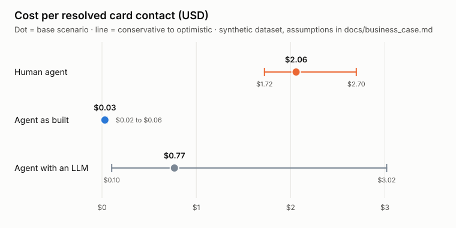

# Business case: cost per resolution

**Answer (base scenario):** the agent resolves a card contact for about
**USD 0.77**, against **USD 2.06** for a human agent, and pays for itself once
it safely closes **25%** of the simple contacts it receives. Over the
conservative-to-optimistic range the agent costs USD 0.10 to 3.02 per
resolution: with every assumption against it, the agent loses money. Three
design levers fix that, even in the worst case
([Protecting the margin](#protecting-the-margin)), and the prototype measures
the two inputs that decide the result (see [Next](#next)).

The money is not the headline. What the agent changes first is risk: it blocks
a card in the first conversation, after verification and explicit
confirmation, and hands the dispute to a human linked to the exact card and
transaction, which happens in 0% of today's cases
([workflow_selection.md](workflow_selection.md)).

Reproduce: run [`Q12`](../data-engineering/analysis/Q12_business_case.sql) in
Snowflake, then
`python data-engineering/analysis/business_case_estimate.py --svg docs/img/business_case_cost_per_resolution.svg`
(standard library only). Every assumption lives in one block at the top of the
script.

## Results

Scenarios move every assumption together: **conservative** sets all of them
against the agent, **optimistic** all in its favour.

| Metric | Conservative | Base | Optimistic |
| --- | --- | --- | --- |
| Card contacts the agent takes, per year | 20,771 | 31,410 | 51,161 |
| Contained without a human, per year | 3,701 (18%) | 10,223 (33%) | 24,846 (49%) |
| Human cost per resolution (USD) | 1.72 | 2.06 | 2.70 |
| Agent cost per conversation (USD) | 0.54 | 0.25 | 0.05 |
| Agent cost per resolution (USD) | 3.02 | 0.77 | 0.10 |
| Containment needed to break even | 75% | 25% | 3% |
| Net saving per 1,000 card contacts (USD) | -324 | 254 | 1,000 |
| Net saving per year (USD) | -6,723 | 7,989 | 51,146 |
| Unrecognized-charge intake calls, net saving per year (USD) | -262 | 2,003 | 5,436 |

Read the yearly totals with care: the dataset is a synthetic bank with
686,296 contacts in three years, so absolute savings are small. The figure
that scales to a real bank is the **saving per 1,000 contacts** and the
**break-even containment**.

## What is measured and what is assumed

| Input | Value | Type | Source |
| --- | --- | --- | --- |
| Data window | 1,098 days (2023-06-17 to 2026-06-18) | Measured | Q12 block 2 |
| Card holders' contacts, Técnico | 62,484; 360.8 s mean; 69.8% resolved; 59.4% simple pool | Measured | Q12 block 3 |
| Card holders' contacts, Producto | 91,418; 266.5 s; 89.7%; 76.2% | Measured | Q12 block 3 |
| "Cargo no reconocido" complaints of card holders | 7,620 | Measured | Q12 block 4, [profile_core.md](../data-engineering/docs/profile_core.md) |
| Cards in the product portfolio | 35% (140,040 of 400,000) | Measured | Q08 |
| Which contacts are card contacts | Técnico, plus 0% / 35% / 100% of Producto | **Assumption** | Gap 3, Gap 12: no field identifies them |
| Simple pool | Resolved at first contact and no follow-up | Definition | The ceiling of what the agent could close alone |
| Containment of the simple pool | 30% / 50% / 70% | **Assumption** | Labels carry no signal (Gap 7), so it cannot be learned from the data |
| Fully loaded agent hour, nearshore LATAM | USD 12 / 15 / 20 | **Assumption** | Published vendor rates: Colombia 12–18, Mexico 12–20 ([Call Force](https://callforce.global/blog/cost-of-nearshore-outsourcing/)); LATAM 10–30 ([Continental Message Solution](https://www.continentalmessage.com/blog/contact-center-outsourcing-cost-comparison/)) |
| After-call work not in `duration_seconds` | 0% / 15% / 30% | **Assumption** | Not recorded in the dataset |
| Model | Sonnet 4.5 regional / Sonnet 4.5 global / Haiku 4.5 | **Assumption** | Sonnet 4.5 is the model in the Strands agent today |
| Price per million tokens (in / out) | 3.30 / 16.50; 3.00 / 15.00; 1.00 / 5.00 USD | Looked up | [Claude pricing](https://platform.claude.com/docs/en/about-claude/pricing) (regional endpoints on Bedrock +10%) |
| Tokens per conversation (in / out) | 120k / 8k; 60k / 4k; 30k / 2k, no prompt caching | **Assumption** | ~8 turns, system prompt and tool schemas re-sent on each model call |
| AgentCore, gateway, Lambda, DynamoDB | USD 0.01 per conversation | **Assumption** | [AgentCore pricing](https://aws.amazon.com/bedrock/agentcore/pricing/): CPU billed only while active, USD 0.005 per 1,000 gateway calls |
| Intake call of an unrecognized charge | 434.4 s (mean Queja contact) | **Assumption** | `origin_interaction_id` is always null (Gap 12) |

Prices were read on 2026-10-03.

## How it is computed

- Human cost per contact = mean duration × (1 + after-call work) × hourly cost.
- Human cost per resolution = human spend ÷ contacts resolved at first contact.
- Agent cost per resolution = every in-scope conversation × cost per
  conversation ÷ contacts contained. The agent pays for the conversations it
  hands off too.
- Net saving = human cost avoided on contained contacts − agent spend on all
  in-scope contacts.
- Unrecognized charges: the agent replaces the intake call only (verified
  block + handoff); the dispute itself, 15.4 days on average, stays human and
  is not counted as a saving.

## Limits

- The dataset is synthetic; labels depend only on the category (Gap 7), so
  card holders and other customers behave the same.
- No field identifies a card contact or links a complaint to its call
  (Gap 12): scope is a team assumption, stated above.
- Containment and tokens per conversation are the two inputs that decide the
  result, and neither can come from this dataset.

## Protecting the margin

Agent cost is driven by tokens, and tokens are a design choice. Keeping every
business input of the conservative scenario (USD 12 per hour, 30%
containment, Técnico only) and changing only how the agent is built:

| Design | Cost per conversation (USD) | Break-even containment | Net per 1,000 contacts (USD) |
| --- | --- | --- | --- |
| Conservative as is (Sonnet regional, 120k / 8k tokens) | 0.54 | 75% | -324 |
| + prompt caching, 70% of input from cache | 0.29 | 40% | -74 |
| + caching and 60k / 4k tokens | 0.15 | 21% | 65 |
| Haiku for 80% of calls, Sonnet for the rest | 0.24 | 34% | -29 |
| **All three (`conservative + levers` in the script)** | **0.07** | **10%** | **143** |

The levers, in order of impact:

1. **Prompt caching.** The system prompt and tool schemas are re-sent on
   every model call; cached reads cost 10% of the input price. Bedrock
   supports it for Claude.
2. **Model routing.** Haiku 4.5 identifies, looks up and explains; Sonnet 4.5
   only confirms the block and writes the dispute handoff.
3. **Shorter conversations.** Quick actions in the UI (card status, recent
   transactions) call read-only endpoints directly instead of the model; the
   frontend's `ui_actions[]` contract already carries them.
4. **Scope gating.** Contacts the agent cannot resolve go straight to a human,
   so no conversation is paid for only to be handed off.

Levers 1 and 2 belong to the agent's design and are recommendations for the
backend, not changes made here.

## Next

- [ ] Measure tokens per conversation from AgentCore traces on the evaluation
      set and replace the token assumption.
- [ ] Measure the safe containment rate on the evaluation set (Phase 9:
      "safe automated resolution rate", "cost per successful resolution").
- [ ] Re-run the script with both and update this page.
- [ ] Agree with the backend owner on prompt caching and model routing.
